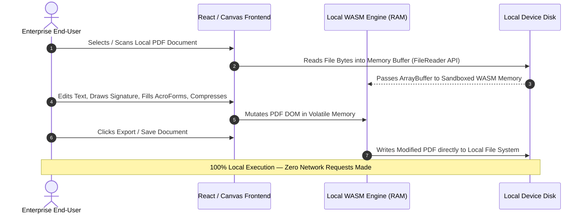

# ISASecuredPDF Suite: Enterprise Technical Architecture & Security Whitepaper
**Document Version:** 1.0  
**Target Audience:** Chief Information Security Officers (CISOs), Enterprise Architects, Compliance Directors, Procurement & IT Security Assessment Boards  
**Vendor Legal Entity:** ISASecuredPDF Inc. (Quebec, Canada)  
**Official Domain:** [https://www.isasecuredpdf.com/](https://www.isasecuredpdf.com/)  

---

## 1. Executive Summary

Traditional document processing solutions (such as Adobe Acrobat Online, Smallpdf, or iLovePDF) rely on cloud-hosted SaaS architectures. In these legacy models, sensitive enterprise documents—containing proprietary intellectual property, financial audit data, personal identifiable information (PII), or protected health information (PHI)—are transmitted over public networks to third-party cloud servers for rendering, editing, OCR, or compression. This inherent architectural flaw creates significant attack vectors, supply-chain vulnerabilities, and compliance liabilities under strict regulatory frameworks.

**ISASecuredPDF Suite** completely eliminates this threat model by implementing a revolutionary **100% On-Device, Air-Gapped Client-Side Architecture**. Utilizing high-performance WebAssembly (WASM) and isolated client-side runtime environments, ISASecuredPDF executes 100% of document processing—including text editing, vector drawing, AcroForm filling, digital signing, AES-256 encryption, and camera scanning—locally within the endpoint's volatile memory (RAM). 

Zero bytes of document content, metadata, keystrokes, or telemetry are ever transmitted across external networks.

```mermaid
graph TD
    subgraph Legacy Cloud PDF SaaS Model
        A[User Device] -->|Transmits Confidential PDF over Internet| B(Third-Party Cloud Server)
        B -->|Processes File on Shared Cloud Infrastructure| C[(Cloud Storage / Disk)]
        C -->|Risk of Data Breach, Subpoena, Interception| B
        B -->|Returns Edited PDF| A
    end

    subgraph ISASecuredPDF Air-Gapped Architecture
        D[User Device / Mobile / Desktop] -->|Loads Static App Assets ONCE| E[Local Device RAM / Browser WASM]
        E <-->|100% Local In-Memory Processing| F[(Device File System / Storage)]
        E -.-X|ZERO Network Egress / Air-Gapped| G((External Network / Internet))
    end
```

---

## 2. Core Architectural Pillars

### 2.1 Zero-Knowledge & Zero Network Egress
ISASecuredPDF enforces a strict **Zero-Knowledge Architecture**. The application contains zero outbound network API hooks for file payload processing. Once static assets (HTML/JS/WASM binaries) are loaded by the client runtime, the document processing engine functions in complete isolation. 

* **No Server-Side Storage:** There are no backend database servers, bucket stores (S3), or serverless functions handling document data.
* **Air-Gapped Operation:** The suite maintains 100% feature parity when operating in completely air-gapped environments without internet access.

### 2.2 WebAssembly (WASM) Isolation Engine
At the core of ISASecuredPDF is a compiled WebAssembly binary stack executed within the client browser’s sandboxed virtual machine:

* **Memory Security:** WASM operates within a strictly allocated, linear memory space that cannot access host system memory outside its sandbox bounds.
* **Deterministic Garbage Collection:** Upon closing a document tab or resetting the workspace, all allocated WASM memory buffers are zeroed out and freed, leaving no persistent memory artifacts on the endpoint.

---

## 3. Detailed Data Flow & Security Boundaries



### 3.1 Data Flow Analysis
1. **Ingestion Phase:** The user opens a PDF file via native drag-and-drop or device camera input. The HTML5 `FileReader` interface converts the file directly into an in-memory `ArrayBuffer`.
2. **Processing Phase:** Text extraction, font embedding, vector annotation, and image resampling are performed in client memory by the compiled WASM modules.
3. **Encryption Phase:** Document protection utilizes the native browser `WebCrypto` API to apply **AES-256** or **AES-128** encryption directly to the PDF stream prior to serialization.
4. **Persistence Phase:** The modified binary stream is saved directly back to the local file system via standard browser blob download or native OS storage APIs.

---

## 4. Regulatory & Security Compliance Alignment

| Regulatory Framework | Compliance Impact of Legacy SaaS PDF Tools | **ISASecuredPDF Compliance Advantage** |
| :--- | :--- | :--- |
| **GDPR (EU)** | High Risk: Requires Data Processing Agreements (DPAs), cross-border transfer mechanisms, and sub-processor audits. | **Compliant by Design (Art. 25 & 32):** No personal data is collected, stored, or processed by ISASecuredPDF. Zero DPA overhead. |
| **HIPAA (US)** | High Risk: Transmitting PHI to cloud PDF servers requires executing Business Associate Agreements (BAAs). | **Exempt from BAA Requirement:** PHI never leaves the healthcare provider's workstation or mobile device. |
| **SOC 2 Type II / ISO 27001** | Requires audit of third-party PDF vendor’s cloud security, data retention, and access controls. | **Drastically Reduces Audit Scope:** Eliminates third-party SaaS vendors from the enterprise data pipeline. |
| **PIPEDA / Law 25 (Canada)** | Strict restrictions on third-party data sharing and mandatory breach notifications. | **Zero Breach Surface:** Because no data is ingested or stored by ISASecuredPDF, data leakage risks are zero. |

---

## 5. Technical Stack & Component Specifications

* **Frontend Framework:** React 18, TypeScript, TailwindCSS.
* **Rendering Engine:** HTML5 Canvas 2D / WebGL acceleration for sub-millisecond document page rendering.
* **PDF Operations Core:** Custom WASM-compiled `pdf-lib` & `MuPDF` core modules for PDF page manipulation, font parsing, and AcroForm structure tree generation.
* **Cryptography:** Native `window.crypto.subtle` (WebCrypto API) implementing FIPS 140-2 compliant AES-GCM and AES-CBC algorithms.
* **Native Wrappers:** Capacitor 6 / Electron wrappers providing native Android, iOS, Windows, and macOS application bundles.

---

## 6. Enterprise Deployment Models

ISASecuredPDF supports flexible deployment architectures designed to satisfy stringent corporate IT policies:

1. **Air-Gapped Static Enterprise Hosting:**
   * Host the static compiled distribution (`dist/`) internally behind enterprise firewalls (e.g., internal NGINX, IIS, or AWS S3 Private VPC Endpoint).
2. **Native Mobile MDM / MAM Distribution:**
   * Distribute compiled native APK/AAB (Android) or IPA (iOS) packages directly through enterprise Mobile Device Management (MDM) suites like Microsoft Intune, VMware Workspace ONE, or MobileIron.
3. **Native Desktop MSI / DMG Distribution:**
   * Deploy standalone desktop applications via Group Policy Objects (GPO) or System Center Configuration Manager (SCCM).

---

## 7. Conclusion & Summary for Security Review Boards

**ISASecuredPDF Suite** represents a paradigm shift in enterprise document privacy. By replacing vulnerable cloud-processing pipelines with **100% client-side WebAssembly execution**, enterprise organizations eliminate data breach vectors, reduce regulatory compliance friction, and maintain absolute sovereignty over their intellectual property and confidential records.

**Contact for Technical Inquiries & Enterprise Procurement:**  
**Security & Architecture Team:** `security@isasecuredpdf.com`  
**Vendor:** ISASecuredPDF Inc.  
**Website:** [https://www.isasecuredpdf.com/](https://www.isasecuredpdf.com/)
